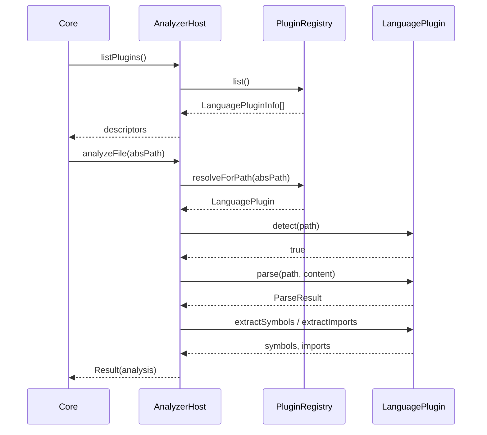

# @prism/analyzer

Language plugin SPI and analyzer host. **Surfaces must not import this package** — Core wires it (ADR-0004).

**Implemented:** M-004 (SPI + registry + noop)  
**Next:** M-006 TypeScript/JS plugin (Oxc)  
**Depends on:** `@prism/shared`

## LanguagePlugin SPI

| Member | Role |
|---|---|
| `id` | Stable plugin id (`typescript`, `noop`, …) |
| `spiVersion` | Must be in host range (currently `1`) |
| `extensions` | Exclusive file extensions (e.g. `.ts`) |
| `capabilities` | `detect` / `parse` / `extractSymbols` / `extractImports` |
| `detect` | Should this plugin handle the path? |
| `parse` | Source → opaque `ParseResult` |
| `extractSymbols` / `extractImports` | Structured extractions from parse |

## Sequence — index path (host)



## Registry rules

- Duplicate `id` → `PRISM_VALIDATION`
- Two plugins claim the same extension → `PRISM_VALIDATION` (conflict)
- `spiVersion` outside host min/max → `PRISM_UNSUPPORTED`

## Usage (Core / tests only)

```ts
import {
  createAnalyzerHost,
  createNoopPlugin,
} from "@prism/analyzer";

const host = createAnalyzerHost({ plugins: [createNoopPlugin()] });
host.listPlugins(); // [{ id: "noop", extensions: [".noop"], ... }]
```

See [ADR-0005](../../plans/adr/0005-analyzer-plugin-isolation.md).
