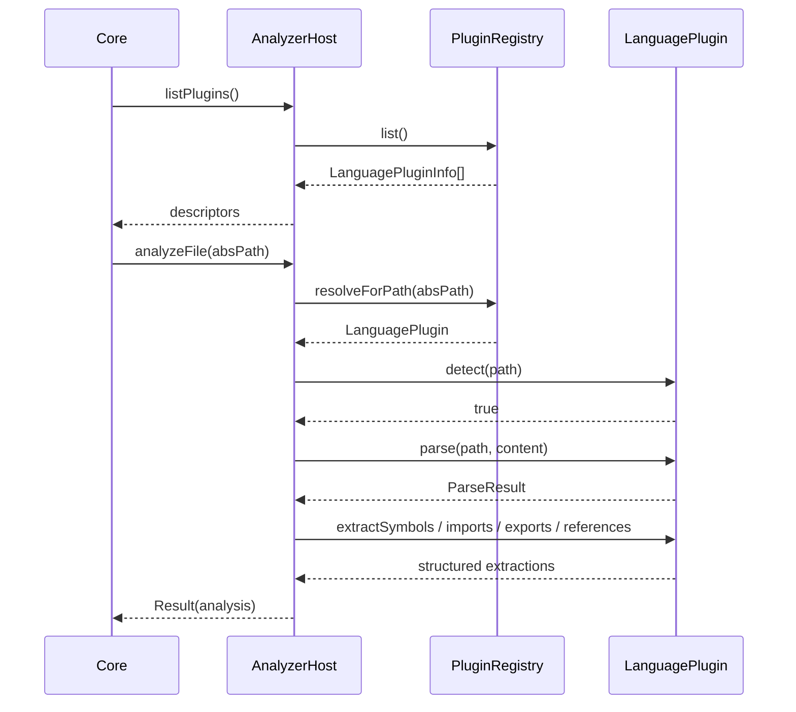

# @prism/analyzer

Language plugin SPI and analyzer host. **Surfaces must not import this package** — Core wires it (ADR-0004).

**Implemented:** M-004 (SPI + registry + noop), M-006 (Oxc TypeScript/JS plugin)  
**Depends on:** `@prism/shared`, `oxc-parser`  
**Throughput:** see [THROUGHPUT.md](./THROUGHPUT.md) · deep TS: [ADR-0009](../../plans/adr/0009-oxc-parser-v1-deep-ts-optional.md)

## LanguagePlugin SPI

| Member | Role |
|---|---|
| `id` | Stable plugin id (`typescript`, `noop`, …) |
| `spiVersion` | Must be in host range (currently `1`) |
| `extensions` | Exclusive file extensions (e.g. `.ts`) |
| `capabilities` | detect / parse / extractSymbols / extractImports / extractExports / extractReferences |
| `detect` | Should this plugin handle the path? |
| `parse` | Source → opaque `ParseResult` (+ file-level `diagnostics`) |
| `extract*` | Symbols, imports, exports, call-site reference hints |

## Sequence — index path (host)



## TypeScript plugin (M-006)

```ts
import {
  createAnalyzerHost,
  createTypescriptPlugin,
  createNoopPlugin,
} from "@prism/analyzer";

const host = createAnalyzerHost({
  plugins: [createTypescriptPlugin(), createNoopPlugin()],
});
await host.analyzeFile("/abs/path/file.ts");
```

Extensions: `.ts` `.tsx` `.mts` `.cts` `.js` `.jsx` `.mjs` `.cjs`.  
Golden fixtures: `fixtures/sample.ts`, `fixtures/sample.tsx`, `fixtures/multi/`.

## Registry rules

- Duplicate `id` → `PRISM_VALIDATION`
- Two plugins claim the same extension → `PRISM_VALIDATION` (conflict)
- `spiVersion` outside host min/max → `PRISM_UNSUPPORTED`

See [ADR-0005](../../plans/adr/0005-analyzer-plugin-isolation.md).
