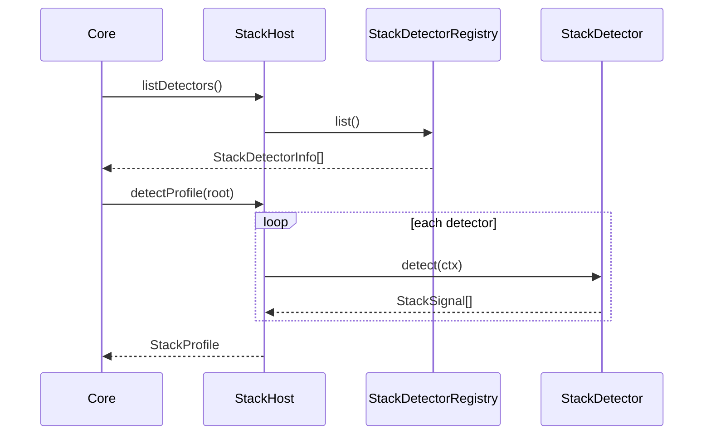

# @prism/intelligence

Stack detection SPI, Repository DNA, health, and insights.

**Implemented:** M-040 (Stack Detector SPI + stubs)  
**Next:** M-013 rich detector packs (FE/BE/Mobile/Data-ML-AI/personas)  
**Depends on:** `@prism/shared`  
**Surfaces:** via `@prism/core` only (ADR-0004 / ADR-0007)

## StackDetector SPI

| Member | Role |
|---|---|
| `id` | Stable detector id |
| `spiVersion` | Must be in host range (currently `1`) |
| `domains` | Domains this detector may emit |
| `personaHints` | Personas it may suggest |
| `detect(ctx)` | → additive `StackSignal[]` |

Well-known domain / persona ids: `StackDomain` / `DeveloperPersona` in `@prism/shared` (open string registry).

## Sequence

## Stubs (M-040)

- `unknown` — emits nothing  
- `nodejs-manifest` — `package.json` → low-confidence `tooling` signal  

## See also

- [ADR-0007](../../plans/adr/0007-stack-detector-spi.md)
- [M-040](../../plans/milestones/M-040_stack-detector-spi.md)
