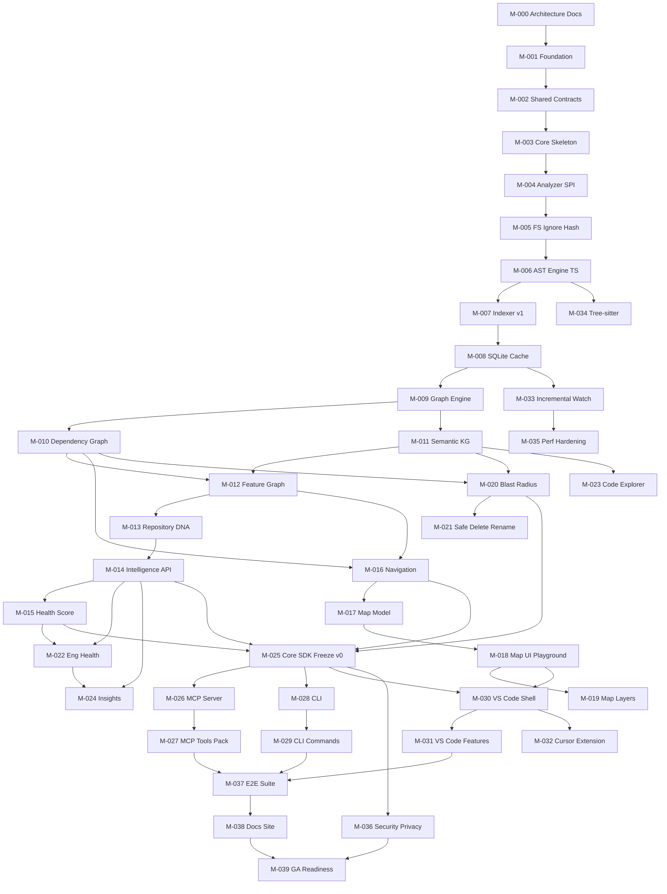

# Prism — Master Development Plan

> **Status:** APPROVED  
> **Version:** 0.1.0  
> **Last updated:** 2026-07-20  
> **Approved:** 2026-07-20 (owner)  
> **Supersedes working name:** RepoPulse  
> **Single source of truth** for product architecture, milestones, and engineering workflow.

**Master Plan approved.** Next: **M-000** architecture docs, then **M-001** implementation.

---

## 1. Executive Summary

Prism is a **local-first Software Intelligence Engine** that helps developers and AI coding agents understand, navigate, analyze, and safely evolve any software repository.

It is **not** an AI coding assistant. It is the intelligence layer that powers:

| Consumer | Interface |
|---|---|
| Humans | VS Code Extension, Cursor Extension, CLI |
| AI Agents | MCP Server |

All interfaces share one Core engine: indexing, AST analysis, graphs, repository intelligence, change impact, and engineering health.

This plan defines a **milestone-driven** roadmap. Each milestone is independently buildable, reviewable, verifiable, and mergeable. Core is built before surfaces. Every surface is a thin adapter over Core.

---

## 2. Product Vision

> **Google Maps + Engineering Intelligence + MCP Tools for Software**

Prism makes a repository spatially navigable and analytically queryable—offline, private, and AI-agnostic.

### Product Principles

| Principle | Meaning |
|---|---|
| Local-first | All analysis runs on the developer machine by default |
| Offline-first | No network required for core workflows |
| Privacy-first | Source never leaves the machine unless the user opts in |
| AI-agnostic | Core has no coupling to any LLM vendor |
| Framework-agnostic | Detect frameworks; never hard-require one |
| Zero cloud dependency required | Cloud features (if any) are optional and post-GA |
| Zero vendor lock-in | Open contracts, portable cache, exportable graphs |
| One shared Core | MCP / CLI / VS Code / Cursor all call the same APIs |
| Extensible plugins | Languages & detectors are SPI plugins |
| Production quality | Strict TS, tests, verify gates, ADRs |
| Cross-platform | macOS, Linux, Windows |

---

## 3. Product Deliverables

### 3.1 Prism Core

Shared intelligence engine:

- Repository indexing (full + incremental)
- Static / AST analysis
- Semantic Knowledge Graph
- Feature Graph
- Dependency Graph
- Repository Intelligence (DNA, detection, health)
- Change Impact Analysis
- Engineering Health metrics

### 3.2 VS Code Extension

Human IDE surface: Repository Map, Explorer, Blast Radius, Health, Code Explorer, Smart Navigation, Insights, overlays.

### 3.3 Cursor Extension

Native Cursor experience sharing the same Core (and preferably the same extension package where API parity allows).

### 3.4 MCP Server

Expose Prism intelligence to Cursor Agents, Claude Code, Gemini CLI, Codex CLI, and any MCP client.

### 3.5 CLI

Local analysis for scripting and CI (`prism analyze`, `prism health`, `prism blast-radius`, …).

---

## 4. Technology Stack

### 4.1 Tech stack — **LOCKED** (2026-07-20)

| Layer | Choice | Rationale |
|---|---|---|
| Language | TypeScript (strict) | One language across Core, MCP, extensions, UI |
| Runtime | Node.js **≥ 26** (pin latest 26.x) | Latest Current stable; extension host is Node/Electron |
| Package manager | **Bun** | Fast installs/scripts; workspaces + `bun.lock` |
| Monorepo task runner | **moonrepo** | Toolchain pinning + fast task graph (see ADR-0003) |
| JS/TS parser (v1) | **Oxc parser** | High-throughput AST; same family as Oxlint/Oxfmt |
| Multi-lang later | **Tree-sitter** (M-034) | Polyglot syntax; not JS/TS v1 primary |
| Optional deep TS later | ts-morph / `tsc` program (ADR if needed) | Only if Oxc semantics are insufficient |
| Graphs | **ngraph** | Leaner perf/memory at repo scale |
| Local cache | **better-sqlite3** | Fast sync SQLite; Node-compatible for extensions |
| MCP | Official MCP SDK | Standard agent protocol |
| CLI | Commander + `@prism/core` | Thin adapter |
| UI (Map / Playground) | React + **Vite** + Tailwind + **React Flow** + Zustand | Fast Map v1; cluster for scale |
| Extensions | VS Code Extension API | Cursor-compatible; shared package preferred |
| Test | **Vitest** + Playwright (later) | Fast unit/integration + E2E |
| Lint / format | **Oxlint + Oxfmt** | Top-tier speed; Oxc toolchain |
| Git hooks | **Lefthook** | Fast parallel hooks; not Husky |
| CI | GitHub Actions | Mirrors `bun run verify:milestone` |
| Docs site | VitePress or Astro (M-038 ADR) | Static docs |

Comparisons & tradeoffs: [`adr/0003-locked-performance-stack.md`](./adr/0003-locked-performance-stack.md)  
Tooling/CI detail: [`TOOLING_AND_CI.md`](./TOOLING_AND_CI.md)

### 4.2 Bun + Node + moon notes

- Contributors use **Bun** for install and scripts; **moon** for task orchestration (`moon run …`).
- moon pins **Node 26** + Bun versions for reproducible local/CI toolchains.
- **VS Code / Cursor extension host runs Node** — Core must stay Node-compatible (hence better-sqlite3, not Bun-only sqlite).
- Pin: `engines.node = ">=26"`, `.nvmrc`, and moon `toolchain` config in M-001.

### 4.3 Parser strategy (speed vs semantics)

```text
v1 (M-006):  Oxc parse → symbols/imports/exports (fast path)
later:       Tree-sitter for non-JS languages (M-034)
optional:    ts-morph / tsc program only if reference quality needs it
```

### 4.4 Stack evolution vs original brief

1. Bun + Node 26 (not pnpm / Node 22)
2. moonrepo (not Turborepo)
3. Oxc parser (not ts-morph-first); Tree-sitter for multi-lang
4. ngraph (not graphology)
5. Oxlint + Oxfmt (not Biome/ESLint)
6. better-sqlite3 kept (Node-portable over Bun sqlite)
7. React Flow kept (Cytoscape/WebGL later if Map scale demands)
8. Lefthook + GitHub Actions verify pipeline
---

## 5. Repository Structure

```text
Prism/
├── apps/
│   ├── playground/          # Interactive Map + Core demos
│   └── docs/                # Product & developer docs site
├── packages/
│   ├── shared/              # Types, result types, constants, Zod schemas
│   ├── core/                # Public Core SDK façade
│   ├── analyzer/            # Language plugins, AST, detectors
│   ├── indexer/             # Walk, hash, incremental index orchestration
│   ├── graph-engine/        # Graph store, queries, layout helpers
│   ├── intelligence/        # DNA, health, insights, entropy
│   ├── impact/              # Blast radius, safe delete, rename/test impact
│   ├── navigation/          # Routes, feature nav, path finder
│   ├── repository-map/      # Map model, layers, landmarks, bookmarks
│   ├── mcp-server/          # MCP tool adapters
│   ├── cli/                 # Commander CLI
│   ├── ui/                  # Shared React components (Map, panels)
│   ├── vscode-extension/    # VS Code (and Cursor-compatible) extension
│   └── cursor-extension/    # Cursor-specific packaging/branding (thin)
├── plans/
│   ├── 00_MASTER_DEVELOPMENT_PLAN.md
│   ├── PROGRESS.md
│   ├── architecture/            # M-000: HLD, LLD, tech docs (before code)
│   │   ├── 01_HLD.md
│   │   ├── 02_LLD.md
│   │   ├── 03_TECH_STACK.md
│   │   ├── 04_FOLDER_STRUCTURE.md
│   │   ├── 05_DATA_FLOWS.md
│   │   └── 06_PACKAGE_RESPONSIBILITIES.md
│   ├── milestones/
│   │   └── M-XXX_*.md
│   └── adr/
│       └── NNNN-*.md
├── scripts/
│   └── verify-milestone.sh  # (introduced in M-001)
├── AGENTS.md
├── CLAUDE.md
├── README.md
├── package.json                 # Bun workspaces
├── bun.lock
├── .moon/ + moon.yml            # moonrepo
├── lefthook.yml
├── .oxlintrc* / .oxfmtrc*       # Oxlint + Oxfmt
├── .nvmrc                       # Node 26.x
└── bunfig.toml                  # optional
```

Package naming: `@prism/<name>`.

### 5.1 Pre-implementation architecture docs (M-000)

Before any monorepo / product code (M-001+), produce owner-reviewed docs under `plans/architecture/`:

| Doc | Focus |
|---|---|
| `01_HLD.md` | System context, surfaces → Core, major subsystems, privacy/local-first boundaries |
| `02_LLD.md` | Module boundaries, key interfaces, index/graph/impact pipelines, error model outline |
| `03_TECH_STACK.md` | Locked stack (Bun, Node 26, Oxc, ngraph, …) — why each choice, constraints |
| `04_FOLDER_STRUCTURE.md` | Canonical repo/package layout (expands [`STRUCTURE.md`](./STRUCTURE.md)) |
| `05_DATA_FLOWS.md` | Index → cache → graphs → Core API → MCP/CLI/IDE sequences |
| `06_PACKAGE_RESPONSIBILITIES.md` | What each `@prism/*` owns / does not own |

Full DoD: [`milestones/M-000_architecture-documentation.md`](./milestones/M-000_architecture-documentation.md).

---

## 6. Package Structure (Responsibilities)

| Package | Responsibility | May depend on |
|---|---|---|
| `@prism/shared` | DTOs, errors, Zod contracts, IDs | (none) |
| `@prism/analyzer` | Language SPI, parsers, symbol extractors | shared |
| `@prism/indexer` | Repo walk, ignore, hashing, index jobs | shared, analyzer |
| `@prism/graph-engine` | Graph CRUD, queries, centrality helpers | shared |
| `@prism/intelligence` | DNA, health, insights, entropy | shared, graph-engine, indexer |
| `@prism/impact` | Blast radius, safe delete, impacts | shared, graph-engine, analyzer |
| `@prism/navigation` | Paths, feature routes | shared, graph-engine |
| `@prism/repository-map` | Map layers, zoom model, landmarks | shared, graph-engine, navigation |
| `@prism/core` | Stable public API composing the above | all engine packages |
| `@prism/ui` | React Map & explorer widgets | shared, repository-map (types) |
| `@prism/mcp-server` | MCP tools → core | core, shared |
| `@prism/cli` | CLI → core | core, shared |
| `@prism/vscode-extension` | IDE → core + ui | core, ui, shared |
| `@prism/cursor-extension` | Cursor packaging | vscode-extension (or core+ui) |

**Hard dependency rule:** Interface packages must not reimplement analysis. They call `@prism/core` only.

---

## 7. Development Philosophy

1. **Docs before code** — after Master Plan approval, **M-000** produces HLD / LLD / tech docs before any product implementation (M-001+).
2. **Core before chrome** — graphs and intelligence before IDE polish.
3. **Contracts first** — shared types and public API shape before deep features.
4. **One language vertical** — ship excellent TypeScript/JavaScript before multi-lang.
5. **Thin adapters** — MCP / CLI / extensions are presentation + I/O.
6. **Small milestones** — independently verifiable; prefer split over mega-PRs.
7. **Plan is law** — Master Plan + milestone docs are the SoT; update on merge.
8. **ADRs for forks** — technology or architectural pivots require an ADR.
9. **Verify always** — no code merge without `bun run verify:milestone` (M-001+). M-000 uses a docs review checklist.

---

## 8. Branch Workflow

### 8.1 Mandatory lifecycle (every milestone)

```text
Create milestone branch from main
↓
Develop on milestone branch (working tree only — NO commits yet)
↓
Verify
↓
Fix Issues
↓
Owner Review
↓
Owner Approves → then create commit(s) on the milestone branch
↓
Owner Approves merge
↓
Merge to main (LOCAL ONLY)
↓
Mark milestone Verified
↓
Create NEXT milestone branch from updated main
↓
Repeat
```

### 8.2 Hard Rules (verbatim)

- Never implement product code before the Master Plan is approved **and M-000 Architecture Documentation is Verified**.
- **Never create git commits until the owner explicitly approves** (e.g. “approve”, “commit”, “approve M-XXX”). Keep work uncommitted in the working tree until then.
- One active milestone at a time.
- One milestone = one Git branch.
- Never develop on main.
- Never stack milestone branches.
- Never merge without owner approval.
- Never push unless owner explicitly asks.
- Every milestone must pass the complete verification suite.
- Every merge to main must leave the repository buildable.
- Every milestone must update the Master Plan progress.

### 8.3 Branch naming

```text
milestone/M-XXX-short-name
```

Examples:

- `milestone/M-001-project-foundation`
- `milestone/M-002-shared-contracts`
- `milestone/M-007-repository-indexer`

### 8.4 Commit expectations

- **No commits before owner approval** of the milestone work (or an explicit “commit” request)
- After approval: conventional commits preferred (`feat:`, `fix:`, `docs:`, `chore:`, `test:`, `refactor:`)
- Commits only on the active milestone branch
- Main advances only via owner-approved merges

---

## 9. Verification Workflow

### 9.1 Unified command

```bash
bun run verify:milestone
```

Runs the full gate for the changed packages (and always for shared/core when present):

1. Typecheck
2. Lint / format check
3. Unit tests
4. Integration tests
5. Build
6. Performance checks (when milestone defines budgets)
7. Docs / plan progress checks (scripted where possible)

### 9.2 Per-milestone verification matrix

Every milestone document must define:

| Gate | Required |
|---|---|
| Typecheck | Always (once TS exists) |
| Lint / format | Always (Oxlint + Oxfmt once wired) |
| Unit tests | Always for packages touched |
| Integration tests | When cross-package behavior ships |
| Build | Always |
| Performance checks | When indexing/graph/map scale matters |
| Manual verification | Always (short checklist) |
| Documentation updated | Always (milestone + PROGRESS.md) |

### 9.3 Recommended scripts (introduced in M-001)

```json
{
  "scripts": {
    "build": "turbo run build",
    "dev": "turbo run dev --parallel",
    "typecheck": "turbo run typecheck",
    "lint": "biome check .",
    "lint:fix": "biome check --write .",
    "test": "turbo run test",
    "test:integration": "turbo run test:integration",
    "verify": "bun run typecheck && bun run lint && bun run test && bun run build",
    "verify:milestone": "bun run verify && bun run test:integration && bun run scripts/check-plan-progress.mjs"
  }
}
```

Exact script files land in **M-001**; this section is the contract.

---

## 10. Quality Gates

A milestone may merge only when:

1. `bun run verify:milestone` passes
2. Definition of Done in the milestone doc is fully checked
3. Owner review completed
4. Owner explicit approval recorded (chat or PR note)
5. `plans/PROGRESS.md` updated to Verified
6. Main remains buildable after merge
7. No new TODOs that block the next critical-path milestone

---

## 11. Dependency Graph (Milestones)



---

## 12. Milestone Index

| ID | Name | Phase | Depends on | Detailed doc |
|---|---|---|---|---|
| M-000 | Architecture Documentation (HLD/LLD/Tech) | Docs | Plan approval | Yes |
| M-001 | Project Foundation & Monorepo | Foundation | M-000 | Yes |
| M-002 | Shared Contracts & Error Model | Foundation | M-001 | Yes |
| M-003 | Core Architecture Skeleton | Foundation | M-002 | Yes |
| M-004 | Analyzer SPI & Plugin Host | Analysis | M-003 | Yes |
| M-005 | Filesystem, Ignore & Hashing | Analysis | M-004 | Yes |
| M-006 | AST Engine (TypeScript/JS) | Analysis | M-005 | Yes |
| M-007 | Repository Indexer v1 | Analysis | M-006 | Yes |
| M-008 | Local Persistence (SQLite) | Analysis | M-007 | Yes |
| M-009 | Graph Engine Foundations | Graphs | M-008 | Yes |
| M-010 | Dependency Graph | Graphs | M-009 | Yes |
| M-011 | Semantic Knowledge Graph | Graphs | M-009 | Yes |
| M-012 | Feature Graph v1 | Graphs | M-010, M-011 | Yes |
| M-013 | Repository DNA & Detection | Intelligence | M-012 | Yes |
| M-014 | Repository Intelligence API | Intelligence | M-013 | Yes |
| M-015 | Repository Health Score v1 | Intelligence | M-014 | Summary |
| M-016 | Navigation Engine | Navigation | M-010, M-012 | Yes |
| M-017 | Repository Map Data Model | Map | M-016 | Yes |
| M-018 | Repository Map UI (Playground) | Map | M-017 | Yes |
| M-019 | Map Layers & Views | Map | M-018 | Summary |
| M-020 | Change Impact — Blast Radius | Impact | M-010, M-011 | Yes |
| M-021 | Safe Delete / Rename / Test Impact | Impact | M-020 | Summary |
| M-022 | Engineering Health Metrics | Health | M-014, M-015 | Summary |
| M-023 | Code Explorer Queries | Explorer | M-011 | Summary |
| M-024 | Engineering Insights | Insights | M-014, M-022 | Summary |
| M-025 | Core Public SDK Stabilization | Core | M-014–M-016, M-020 | Yes |
| M-026 | MCP Server Foundation | Surfaces | M-025 | Yes |
| M-027 | MCP Intelligence Tools Pack | Surfaces | M-026 | Summary |
| M-028 | CLI Foundation | Surfaces | M-025 | Yes |
| M-029 | CLI Analysis Commands | Surfaces | M-028 | Summary |
| M-030 | VS Code Extension Shell | Surfaces | M-018, M-025 | Yes |
| M-031 | VS Code Map + Explorer | Surfaces | M-030 | Summary |
| M-032 | Cursor Extension | Surfaces | M-030 | Summary |
| M-033 | Incremental Indexing & Watch | Scale | M-008 | Summary |
| M-034 | Multi-language (Tree-sitter) | Scale | M-006 | Summary |
| M-035 | Performance Hardening | Hardening | M-033 | Summary |
| M-036 | Security & Privacy Hardening | Hardening | M-025 | Summary |
| M-037 | End-to-End Test Suite | Quality | M-027, M-029, M-031 | Summary |
| M-038 | Documentation Site | Docs | M-037 | Summary |
| M-039 | GA Readiness | Release | M-036, M-038 | Yes |

**Critical path (must stay green):** M-001 → M-014 → M-025 → surfaces (M-026/M-028/M-030) → M-039.

---

## 13. Feature → Milestone Mapping

| Feature / Module | Primary milestones | Notes |
|---|---|---|
| Repository Map (interactive) | M-017, M-018, M-019, M-031 | Hero feature; data then UI then IDE |
| Zoom levels / layers | M-017, M-019 | Architecture, deps, activity, ownership, debt, risk, perf, coverage |
| Feature-first navigation | M-012, M-016, M-019 | |
| Search / bookmarks / landmarks | M-017, M-019, M-031 | |
| Dependency routes | M-016, M-019 | |
| Repository DNA | M-013, M-014 | |
| Project / framework / architecture detection | M-013 | |
| Feature / component / dependency graphs | M-010–M-012 | |
| Semantic Knowledge Graph | M-011 | |
| Repository Health Score | M-015 | |
| Blast Radius | M-020 | |
| Safe Delete | M-021 | |
| Rename Impact | M-021 | |
| Dependency / Test Impact | M-021 | |
| Regression prediction / breaking change | M-021, M-035 | v1 heuristic; ML out of scope for GA |
| Risk Score | M-015, M-020, M-022 | |
| Engineering Entropy | M-022 | |
| Architecture Drift | M-022 | |
| Technical Debt | M-022 | |
| Code Churn / Evolution | M-022 | Requires git metadata |
| Merge Conflict Risk | M-022 | Heuristic |
| Knowledge Decay / Hotspots | M-022, M-024 | |
| Code Explorer (usages, ownership, related *) | M-023 | |
| Similar Implementations | M-023 | Structural similarity v1 |
| Git Timeline | M-023 | |
| Smart Navigation | M-016 | |
| Engineering Insights | M-024 | |
| MCP tools | M-026, M-027 | Full tool list in §14 |
| VS Code Extension | M-030, M-031 | |
| Cursor Extension | M-032 | |
| CLI | M-028, M-029 | |
| Playground | M-018, M-019 | |
| Docs | M-038 | |
| Hardening / GA | M-033–M-039 | |

---

## 14. MCP Intelligence APIs (Target Tool Surface)

Exposed in M-026 (foundation) and M-027 (full pack):

| Tool | Milestone |
|---|---|
| `repository_map` | M-027 |
| `repository_health` | M-027 |
| `repository_dna` | M-027 |
| `feature_graph` | M-027 |
| `dependency_graph` | M-027 |
| `blast_radius` | M-027 |
| `safe_delete` | M-027 |
| `rename_impact` | M-027 |
| `architecture_rules` | M-027 |
| `dependency_route` | M-027 |
| `similar_component` | M-027 |
| `engineering_entropy` | M-027 |
| `technical_debt` | M-027 |
| `hotspots` | M-027 |
| `knowledge_decay` | M-027 |

All tools are thin wrappers over `@prism/core` methods with JSON-serializable results.

---

## 15. Detailed Milestone Plans

Critical-path milestones have full documents under `plans/milestones/`. Others are summarized below; expand to full docs when that milestone becomes active.

### 15.1 Summaries (non-critical-path detail)

#### M-015 — Repository Health Score v1
- Inputs: graph metrics, debt signals, test presence, churn (if git available)
- Output: `HealthReport` with score 0–100 + factors
- DoD: deterministic fixture scores; documented weighting ADR

#### M-019 — Map Layers & Views
- Layers: architecture, dependency, activity, ownership, debt, risk, performance, coverage
- Toggle + legend + layer-specific styling
- DoD: ≥5 layers render on playground fixture repo

#### M-021 — Safe Delete / Rename / Test Impact
- APIs: `safeDelete`, `renameImpact`, `testImpact`, `breakingChangeHints`
- DoD: golden tests on fixture monorepo

#### M-022 — Engineering Health Metrics
- Entropy, drift, debt, churn, hotspots, knowledge decay, conflict risk
- DoD: each metric has unit tests + fixture explanation

#### M-023 — Code Explorer Queries
- Find usages, ownership, related components/APIs/features/tests, similar impl, git timeline
- DoD: query API stable in `@prism/core`

#### M-024 — Engineering Insights
- Aggregations: most edited, most coupled, high risk, dependency health, review hotspots
- DoD: insights endpoint returns ranked lists with evidence links

#### M-027 — MCP Intelligence Tools Pack
- Implement all tools in §14
- DoD: MCP inspector smoke + contract tests per tool

#### M-029 — CLI Analysis Commands
- `prism analyze|map|health|dna|blast-radius|safe-delete|insights`
- JSON + human output modes
- DoD: CLI golden snapshots

#### M-031 — VS Code Map + Explorer
- Webview Map, sidebar explorer, commands for blast radius / health
- DoD: manual checklist on sample workspace

#### M-032 — Cursor Extension
- Package/brand for Cursor; verify MCP + extension coexistence
- DoD: install + activate in Cursor; Core path identical

#### M-033 — Incremental Indexing & Watch
- fs.watch / chokidar; invalidation units; partial rebuild
- DoD: edit file → index updates < budget (defined in milestone)

#### M-034 — Multi-language via Tree-sitter
- Python + Go *or* one additional language (ADR)
- DoD: dependency + symbol graph for chosen language fixture

#### M-035 — Performance Hardening
- Budgets for 100k-file class repos (sampling strategy)
- Profiling docs; worker threads if needed
- DoD: published budgets met on fixture

#### M-036 — Security & Privacy Hardening
- Secret redaction in outputs; ignore sensitive paths; no network default
- DoD: security checklist + tests for redaction

#### M-037 — End-to-End Test Suite
- Playwright (playground + extension webview where feasible)
- MCP + CLI integration in CI-local script
- DoD: `bun run test:e2e` green

#### M-038 — Documentation Site
- Install, Core concepts, Map guide, MCP setup, CLI, contributing
- DoD: docs build + link check

Full texts: see `plans/milestones/` for critical path.

---

## 16. ADR Process

1. Author ADR in `plans/adr/NNNN-title.md` using the template.
2. Status: Proposed → Accepted | Rejected | Superseded.
3. Required for: new package, new persistence format, language plugin model changes, public API breaks, new runtime dependency with native bindings.
4. Accepted ADRs are immutable; supersede with a new ADR.
5. Milestone that introduces the decision links the ADR.

Template: [`plans/adr/0000-adr-template.md`](./adr/0000-adr-template.md)

---

## 17. Change Management

| Change type | Process |
|---|---|
| Bugfix inside active milestone | Fix on milestone branch; re-verify |
| Scope add to active milestone | Owner approval; update milestone DoD |
| New milestone | Owner approval; update Master Plan index + PROGRESS |
| Reorder milestones | Owner approval; update dependency graph |
| Public API break after M-025 | ADR + major version policy |
| Plan corrections (typos, clarity) | Allowed on milestone branch or docs-only milestone |

**Progress updates are mandatory** on every milestone merge (`plans/PROGRESS.md` + this plan’s status table if needed).

---

## 18. Progress Tracking

Canonical tracker: [`plans/PROGRESS.md`](./PROGRESS.md)

Statuses:

| Status | Meaning |
|---|---|
| `Not Started` | No branch |
| `In Progress` | Active milestone branch |
| `In Review` | Verify passed; awaiting owner |
| `Blocked` | Dependency or decision blocker |
| `Verified` | Merged to main with approval |
| `Deferred` | Explicitly postponed by owner |

Only **one** milestone may be `In Progress` at a time.

---

## 19. Architecture Snapshot (Target)

```text
┌─────────────────────────────────────────────────────────────┐
│  Surfaces: VS Code │ Cursor │ MCP │ CLI │ Playground        │
└───────────────────────────┬─────────────────────────────────┘
                            │ @prism/core (public SDK)
┌───────────────────────────▼─────────────────────────────────┐
│  Intelligence │ Impact │ Navigation │ Repository Map         │
└───────────────────────────┬─────────────────────────────────┘
                            │
┌───────────────────────────▼─────────────────────────────────┐
│  Graph Engine  │  Indexer  │  Analyzer (language plugins)    │
└───────────────────────────┬─────────────────────────────────┘
                            │
┌───────────────────────────▼─────────────────────────────────┐
│  SQLite cache │ Workspace FS │ Git metadata (optional)       │
└─────────────────────────────────────────────────────────────┘
```
---

## 20. Out of Scope for GA (explicit)

- Cloud sync / multi-user hosted SaaS
- Fine-tuning or shipping an LLM
- Guaranteeing perfect semantic understanding of all languages
- Auto-applying code edits (Prism advises; agents/humans edit)
- Proprietary IDE forks beyond VS Code / Cursor

---

## 21. Approval

| Role | Name | Date | Decision |
|---|---|---|---|
| Owner | Shailesh Jha | 2026-07-20 | ✅ Approved |

Upon approval, mark this document **Status: APPROVED** and begin **M-000** (architecture docs).  
**Do not start M-001** until M-000 is Verified.

---

## Appendix A — Open Questions

Canonical list: [`OPEN_QUESTIONS.md`](./OPEN_QUESTIONS.md)

## Appendix B — Start Here

After approval: [`START_HERE.md`](./START_HERE.md)

## Appendix C — Related Documents

- [`PROGRESS.md`](./PROGRESS.md)
- [`VERIFICATION.md`](./VERIFICATION.md)
- [`STRUCTURE.md`](./STRUCTURE.md)
- [`milestones/`](./milestones/)
- [`adr/0000-adr-template.md`](./adr/0000-adr-template.md)
- [`adr/0001-product-name-prism.md`](./adr/0001-product-name-prism.md)
- [`adr/0002-toolchain-bun-node-lint.md`](./adr/0002-toolchain-bun-node-lint.md) *(superseded in part by 0003)*
- [`adr/0003-locked-performance-stack.md`](./adr/0003-locked-performance-stack.md)
- [`TOOLING_AND_CI.md`](./TOOLING_AND_CI.md)
- [`DESIGN_SYSTEM.md`](./DESIGN_SYSTEM.md) — Signal Chart (**locked**)
- [`mockups/LOCKED.md`](./mockups/LOCKED.md) — brand PNGs (**locked**); UI mockups deferred
- [`../AGENTS.md`](../AGENTS.md)
- [`../CLAUDE.md`](../CLAUDE.md)
- [`../README.md`](../README.md)
