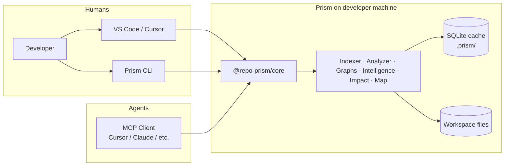
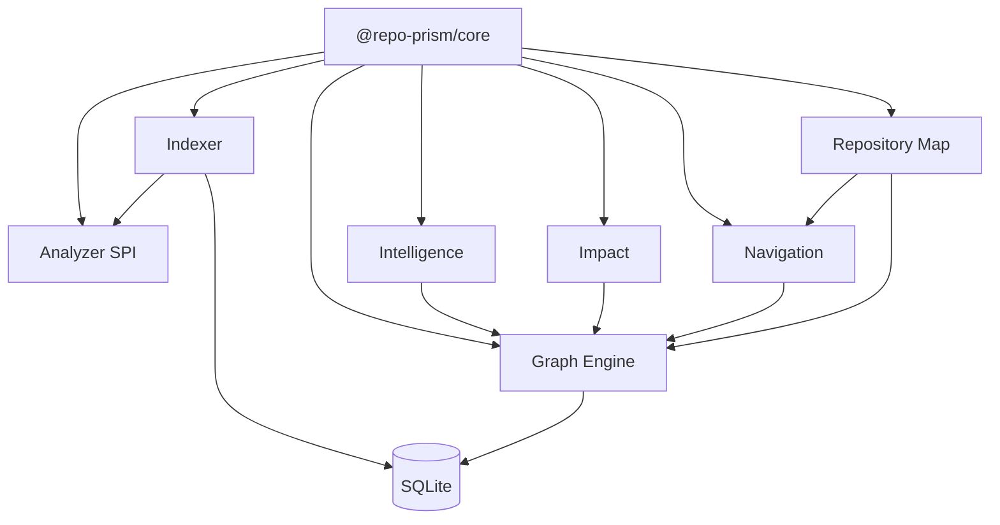

# Prism — High-Level Design (HLD)

| Field | Value |
|---|---|
| Status | Draft (M-000) |
| Audience | Engineers implementing M-001+ |
| SoT cross-links | Master Plan §1–3 · DESIGN_SYSTEM · ADR-0003 |

---

## 1. What Prism is

Prism is a **local-first Software Intelligence Engine**. It turns a repository into navigable terrain: maps, graphs, impact analysis, and health — for humans (IDE/CLI) and AI agents (MCP).

**Prism is not** an AI coding assistant, chat product, or cloud SaaS. It does not ship or call an LLM in Core.

---

## 2. System context

**Boundary rules**

| Rule | Meaning |
|---|---|
| Local-first | Analysis runs on the developer machine |
| Offline-first | Core workflows need no network |
| Privacy-first | Source does not leave the machine by default |
| One Core | MCP / CLI / IDE all call `@repo-prism/core` only |
| AI-agnostic | No LLM vendor coupling in Core |

---

## 3. Product deliverables (surfaces)

| Surface | Role | Talks to |
|---|---|---|
| **Core** | Public SDK — all intelligence | Engines below |
| **MCP Server** | Tools for agents | Core |
| **CLI** | Scripts / CI / terminal | Core |
| **VS Code Extension** | Human Map, explorer, impact | Core + UI |
| **Cursor Extension** | Same experience (thin packaging) | Core + UI |
| **Playground** | Interactive Map demos | Core + UI |

Surfaces are **thin adapters**: I/O, presentation, lifecycle. They must not reimplement analysis.

---

## 4. Major subsystems

| Subsystem | Job |
|---|---|
| **Analyzer** | Language plugins; parse; symbols / imports / exports |
| **Indexer** | Walk repo, ignore rules, hash, orchestrate parse → persist |
| **Graph Engine** | Typed graph store (ngraph); query primitives |
| **Intelligence** | DNA, detection, health score, insights |
| **Impact** | Blast radius, safe-delete / rename / test impact |
| **Navigation** | Routes between features / symbols |
| **Repository Map** | Spatial model, layers, zoom, landmarks |

v1 language vertical: **TypeScript / JavaScript** (Oxc). Multi-lang later (Tree-sitter, M-034).

---

## 5. Quality attributes

| Attribute | Target |
|---|---|
| Extensibility | Language plugins via SPI |
| Performance | Fast index; lean graphs at repo scale |
| Testability | Pure engines; fixtures; Vitest |
| Portability | macOS / Linux / Windows; Node-compatible Core |
| Operability | `bun run verify:milestone`; Lefthook; CI |

---

## 6. Brand & UX (locked)

- Brand mark / lockups: `plans/mockups/LOCKED.md`
- Visual system: **Signal Chart** (`plans/DESIGN_SYSTEM.md`)
- Map is the hero surface; progressive disclosure; CTAs **Open** + **See impact**

---

## 7. Explicit non-goals (GA)

- Cloud sync / multi-tenant SaaS  
- Shipping or fine-tuning an LLM  
- Auto-applying code edits  
- Perfect semantics for every language  

---

## 8. Roadmap position

| Phase | Milestone | Output |
|---|---|---|
| Docs | **M-000** (this pack) | Architecture docs |
| Foundation | M-001–M-003 | Monorepo, contracts, Core skeleton |
| Analysis / graphs | M-004–M-012 | Index + graphs |
| Intelligence / Map / Impact | M-013–M-024 | Product brains + Map |
| Surfaces | M-025–M-032 | SDK freeze → MCP / CLI / IDE |
| Scale / GA | M-033–M-039 | Watch, multi-lang, hardening, GA |
