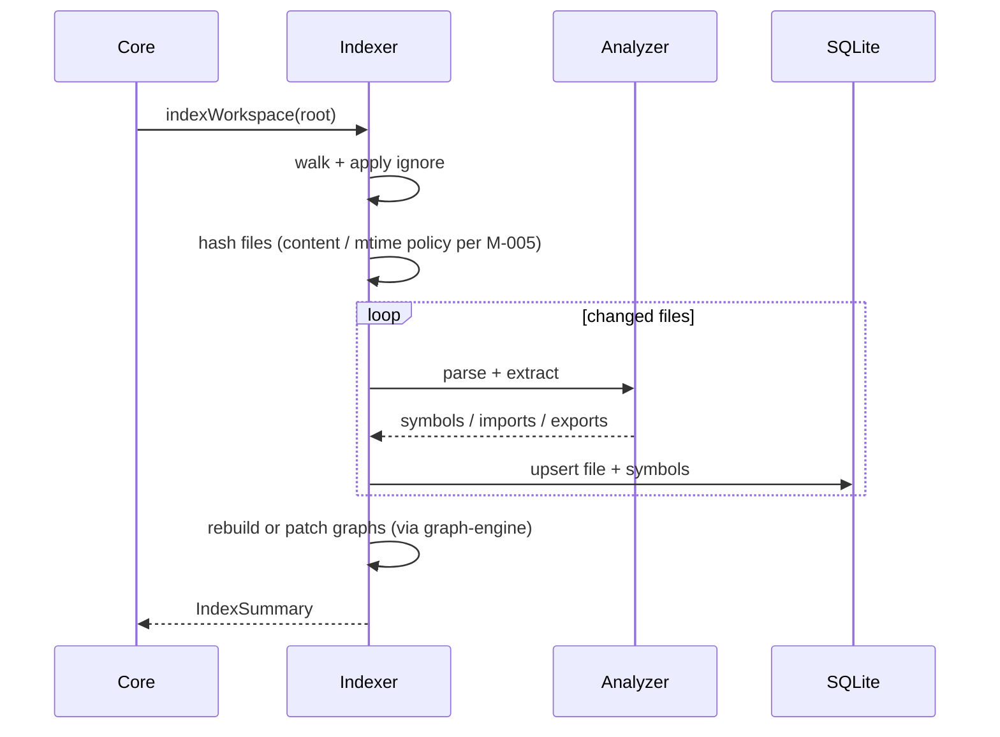
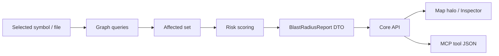

# Prism — Low-Level Design (LLD)

| Field | Value |
|---|---|
| Status | Draft (M-000) |
| Audience | Implementers of Core engines & surfaces |
| SoT | Master Plan §6 · M-002–M-014 milestone docs |

---

## 1. Dependency direction (law)

```text
apps / mcp / cli / vscode / cursor
        ↓  (only)
   @prism/core
        ↓
   engine packages (indexer, analyzer, graphs, …)
        ↓
   @prism/shared
```

- Surfaces **must not** import engine packages directly.
- Engines **must not** import surfaces or `@prism/ui`.
- `@prism/shared` has **no** package dependencies.

---

## 2. Module map

| Layer | Packages | Notes |
|---|---|---|
| Contracts | `shared` | DTOs, Result/AppError, Zod, IDs |
| Ingest | `analyzer`, `indexer` | SPI + walk/hash/index jobs |
| Store | `graph-engine` + SQLite via indexer/cache helpers | ngraph in-memory; SQLite durable |
| Domain | `intelligence`, `impact`, `navigation`, `repository-map` | Compose graphs + index |
| Façade | `core` | Stable public API |
| Presentation | `ui`, extensions, `mcp-server`, `cli` | Adapters |

Exact public method list of Core is finalized across M-002 → M-025; this LLD defines **boundaries and pipelines**.

---

## 3. Error / Result model (outline)

Prefer explicit results over thrown strings:

```ts
// Conceptual — finalized in M-002
type Result<T, E = AppError> =
  | { ok: true; value: T }
  | { ok: false; error: E };

type AppError = {
  code: string;          // stable machine code
  message: string;       // human-readable
  details?: unknown;     // JSON-serializable
};
```

Surfaces map `AppError` → CLI exit codes / MCP error payloads / IDE notifications. Never leak stack traces to agents by default.

---

## 4. Analyzer SPI (sketch)

```text
LanguagePlugin
  id: "typescript" | …
  extensions: [".ts", ".tsx", ".js", ".jsx", …]
  parse(file) → ParseResult
  extract(parseResult) → { symbols, imports, exports, refs? }
```

- Host loads plugins; v1 ships TypeScript/JS plugin (Oxc).
- Deep TS mode (ts-morph) is optional later — not default.

---

## 5. Index pipeline



**Incremental (M-033):** watch FS → rehash dirty set → partial reparse → patch graphs.

---

## 6. Graph model (sketch)

Three logical graphs (may share store with typed edge labels):

| Graph | Nodes (examples) | Edges (examples) |
|---|---|---|
| Dependency | files / packages | `imports`, `depends_on` |
| Semantic | symbols | `calls`, `type_ref`, `implements` |
| Feature | features / regions | `contains`, `related` |

`graph-engine` provides: add/remove node/edge, neighbors, BFS/DFS, path, simple centrality helpers. Layout for Map is a separate concern (`repository-map` / UI).

---

## 7. Impact pipeline (blast radius)



Safe-delete / rename (M-021) builds on the same affected-set primitives.

---

## 8. Core façade (outline)

Conceptual groups (names illustrative):

| Group | Examples |
|---|---|
| Workspace | `open`, `close`, `reindex`, `status` |
| Query | `getDna`, `getHealth`, `search`, `getSymbol` |
| Graph | `getDependencies`, `getFeatureGraph` |
| Map | `getMapModel`, `getLayers` |
| Impact | `blastRadius`, `safeDeleteReport` |
| Navigation | `route`, `related` |

All return JSON-serializable DTOs from `@prism/shared` (or Result wrappers).

---

## 9. Surface adapters

| Surface | Adapter duty |
|---|---|
| MCP | Tool schema → `core.*` → JSON content |
| CLI | argv → `core.*` → human + `--json` |
| VS Code / Cursor | Commands/webview → `core.*` + `@prism/ui` |
| Playground | Vite app → `core.*` + Map |

Lifecycle: create Core client bound to workspace root; dispose on close.

---

## 10. Persistence

| Store | Contents | Package |
|---|---|---|
| SQLite (`better-sqlite3`) | File hashes, symbols, graph snapshots / edges as designed in M-008 | indexer + helpers |
| In-memory ngraph | Hot query graphs after load | graph-engine |

Default cache location (Q-002 default): workspace `.prism/` (gitignored). Confirm in M-008.

---

## 11. Concurrency & process model

- Core runs in-process with the host (CLI / MCP / extension host).
- Index jobs should be cancellable and progress-reportable.
- Extension host is **Node** — Core APIs must remain Node-compatible (no Bun-only natives).

---

## 12. Security / privacy (design constraints)

- No network I/O in Core analysis path.
- Respect `.gitignore` / Prism ignore rules; never index secrets paths by default policy (detail in M-005 / M-036).
- MCP/CLI output is user-local; no telemetry in GA (Q-010 default).
