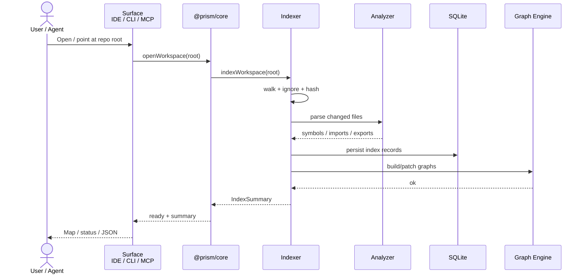
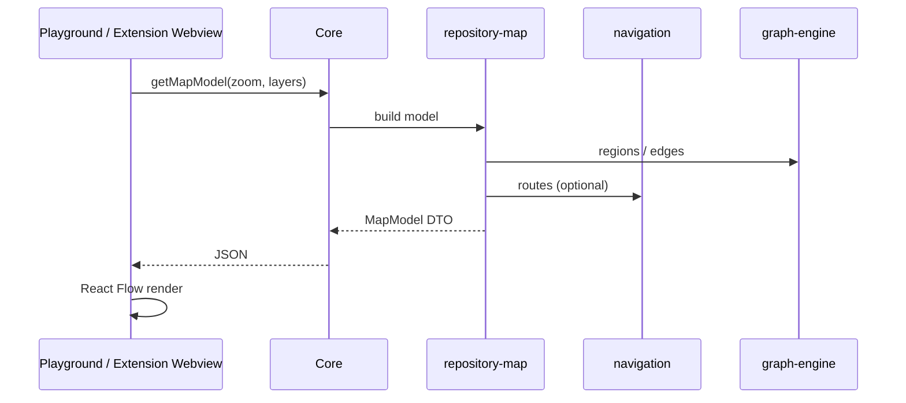
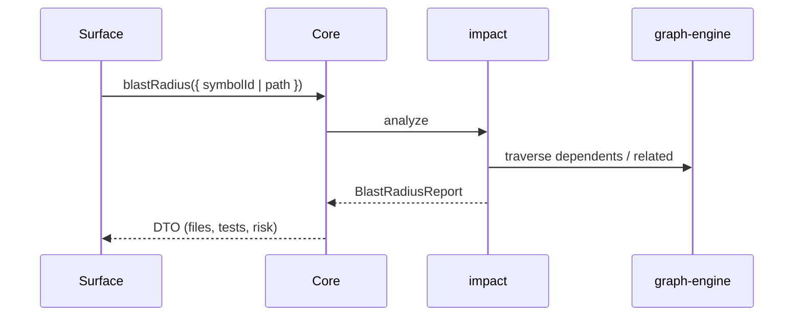
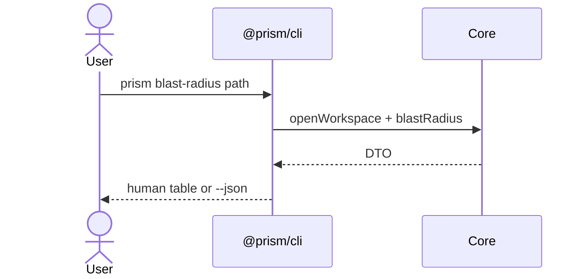

# Prism — Data & Control Flows

| Field | Value |
|---|---|
| Status | Draft (M-000) |
| Audience | Core + surface implementers |

All flows stay on the **local machine** unless the user later opts into optional cloud features (post-GA; not planned for GA).

---

## 1. Open workspace → first index



**What never leaves the machine:** file contents, ASTs, graphs, reports (GA default).

---

## 2. Query: Repository DNA / Health

```mermaid
sequenceDiagram
  participant S as Surface
  participant C as Core
  participant INT as Intelligence
  participant G as Graph Engine
  participant DB as SQLite

  S->>C: getDna() / getHealth()
  C->>INT: compute
  INT->>DB: read index metadata
  INT->>G: metrics / structure queries
  INT-->>C: DnaReport / HealthScore DTO
  C-->>S: Result&lt;DTO&gt;
```

---

## 3. Map model → UI



Selection CTAs in UI call Core again (`open` path is IDE navigation; `see impact` → blast radius).

---

## 4. Blast radius



Same DTO shape for MCP JSON, CLI `--json`, and Inspector UI.

---

## 5. MCP tool call

```mermaid
sequenceDiagram
  actor A as Agent
  participant M as mcp-server
  participant C as Core

  A->>M: tools/call blast_radius
  M->>M: validate args (Zod / shared)
  M->>C: blastRadius(...)
  C-->>M: Result&lt;DTO&gt;
  M-->>A: MCP content (JSON text)
```

MCP must not parse the repo itself — only Core.

---

## 6. CLI command



---

## 7. Cache read/write

| Operation | Read | Write |
|---|---|---|
| Cold index | Workspace files | SQLite + in-memory graphs |
| Warm open | SQLite → hydrate graphs | None if hashes match |
| Incremental | Dirty files only | Patch SQLite + graphs |
| Reindex force | All files | Full rebuild |

Cache root (default): `<workspace>/.prism/` (gitignored). Confirmed in M-008.

---

## 8. Privacy checklist (flows)

- [ ] No analytics beacons in Core  
- [ ] No upload of source in MCP/CLI adapters  
- [ ] Ignore rules applied before parse  
- [ ] Errors sanitized for agent-facing output  
